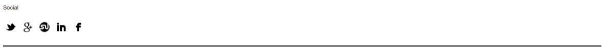

# Basic CSS Web Components

## Instructions

Use what you've learned of CSS styles and properties to recreate the site components shown below. You likely will need to use CSS properties like:

- `margin`, `padding`, `border`
- `font-family`, `font-size`, `font-weight`, `color`
- `width`, `height`
- `background-color`
- `text-align`
- `display: block` and `display: inline-block`

## Setup

```sh
# (1) change directories into the class`assignments/` directory
cd ~/muktek/assignments

# (2) create the directory for the assignment
mkdir basic-css-web-components

# (3) create the css for the assignment
cd basic-css-web-components

# (4) download the
curl https://raw.githubusercontent.com/muktek/assignment--basic-css-web-components/master/assignment-files.zip > assignment-files.zip

# (5) unzip assignment-files.zip zipfile
unzip assignment-files.zip
```

*NOTE:* You will likely want to include `*{box-sizing: border-box}` at the top of your stylesheet

## Normal Mode

### Simple Article Layout


##### Design Specs

```
primary font: Georgia, Palatino, serif;
alternative font: Geneva, Ubuntu, sans-serif;
line-height: 1.25
background-color: FBF9F1
link color: 77A8D2
```

##### Copy
```
Mark Boulton design was a small design studio. In 2014, we were aquired by Monotype.

Over the years, we built an amazing team and worked on some tremendous projects with the smartest clients. That's something we're proud of, and thankful for. But, it's time for a change.

The move to Monotype brings us closer to the problems we want to fix. Mark Boutlon Design is now closed. The team will be working on Monotype projects from the same premises in the UK and we'll still be writing, blogging, and still speaking at web conferences. We're not going anywhere.
```

##### Hint

+ use a `<span>` tag and give it a class attribute to apply targeted styles to the 'Monotype' text

<hr/>

### Menu List


##### *Design Specs*

```
fonts: Avenir
selected itmem font color: `#66CC99`
```


<hr/>

### Icon Set



##### *Design Specs*

```
fonts: sans-serif
images:
  facebook-icon-bw.png
  twitter-icon-bw.png
  stumbleit-icon-bw.png
  googleplus-icon-bw.png
  linkedin-icon-bw.png
```

##### Hint
- to link to the images in the `src` attribute, you may have to go up a directory (`../`) in order to access the image-file in the `/images` directory 	

<hr/>

### Navigation Menu


##### *Design Specs*

```
font: Futura
link background color: rgb(205,92,92)
```

##### Hint
- target only the top + bottom of the element with 'Currently:#summer'  with the `border-top` and `border-bottom` css-properties
- use `display: inline-block` to stack the nav-options next to each other.
- use an `<input type="text"/>` tag to create the 'Search Site' input field where a user could potentially enter information.

<hr/>

## Explorer Mode

### Simple Multi Column Layout


##### *Design Specs*
```
font: Helvetica Neue
top-bar color: #004
link color: `#DE5233`
```
##### Hint
- use `display: inline-block` to stack the columns next to each other and give each column a width of 25%.


<hr/>

## Adventurer Mode

### Complex Multi Column Layout


##### *Design Specs*

```
font: Avenir
link color: `#ff5a5f`
images:
  random-user1.png
```
